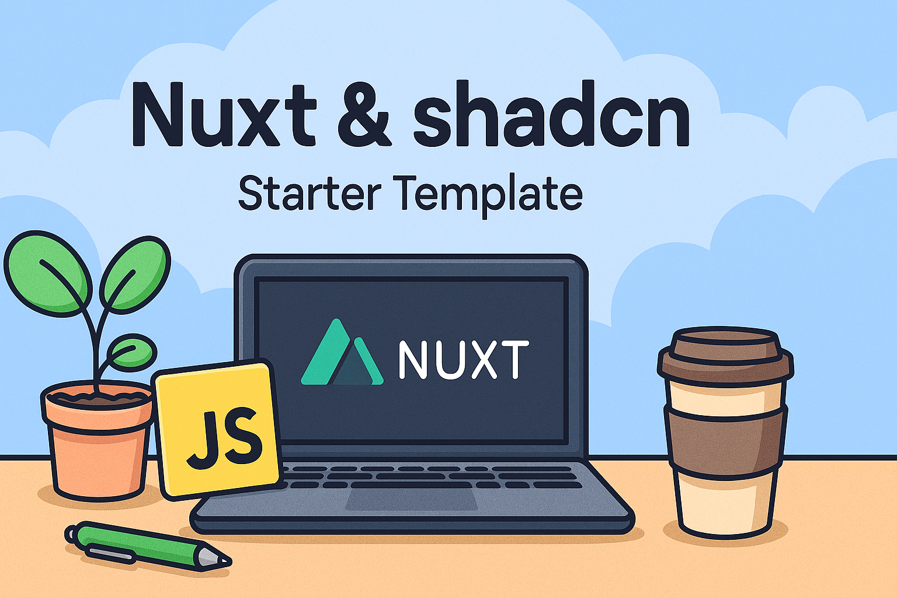

# Nuxt ShadCN-Vue



## 📃 Table of Contents

- [Nuxt ShadCN-Vue](#nuxt-shadcn-vue)
  - [📃 Table of Contents](#-table-of-contents)
  - [🚀 Getting Started](#-getting-started)
  - [📦 Installation](#-installation)
  - [🏃 Running locally](#-running-locally)
  - [⚠️ Troubleshooting](#️-troubleshooting)

## 🚀 Getting Started

Ready to kickstart your Nuxt 3 project with ShadCN-Vue components? This template has everything set up for you, including:

- Nuxt 4
- ShadCN-Vue integration
- Tailwind CSS configuration
- Pre-configured components and styles

## 📦 Installation

In order to use it, as your template just clone the repo and install the dependencies:

```shell
npx nuxi init my-project -t https://github.com/mikelogaciuk/nuxt-shadcn
cd my-project && npm i
```

## 🏃 Running locally

To run the project locally, use:

```shell
npm run dev
```

Then open your browser and navigate to [http://localhost:3000](http://localhost:3000).

## ⚠️ Troubleshooting

Sometimes you might run into issues with dependecies for ShadCN-Vue.

Usually, this helps:

```shell
npm install -D typescript
```
